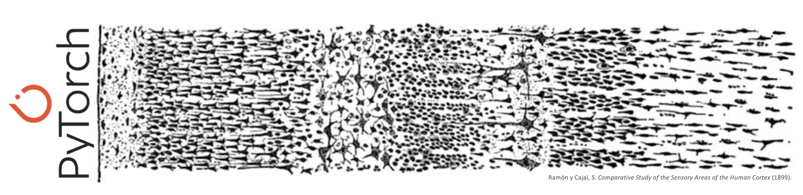

___

[logo]: https://github.com/AladdinPerzon/Machine-Learning-Collection/blob/master/ML/others/logo/youtube_logo.png

# Deep-Learning-Toolkit
In this repository you will find short tutorials related to Deep Learning. I have put together these notebooks over the years for my own use, now puvlishing in case it is useful to the community. Notebooks are structured in the form Question, Answer and respective Code. I try to make the theory as simple as possible, so please look into the mathematical background of the concepts in further detail in your own research. This is a friendly approach to learning basic concepts, please feel free to create issues and PRs 🖤

## Table Of Contents
- 📓 [Array Broadcasting 101: Why your neural networks are fast](https://github.com/meechos/Deep-Learning-Toolkit/blob/main/nbs/Broadcasting_101.ipynb)
- 📓 [Forward pass of neural networks: an interactive breakdown](https://github.com/meechos/Deep-Learning-Toolkit/blob/main/nbs/Forward_pass_of_neural_networks_an_interactive_visual_breakdown.ipynb)
- 📓 [Universality Theorem: a function approximator](https://github.com/meechos/Deep-Learning-Toolkit/blob/main/nbs/Function_approximator_nn.ipynb)
- 📓 [Deep Learning in Prod: Eager model, Graph execution and JIT](https://github.com/meechos/Deep-Learning-Toolkit/blob/main/nbs/Prod_jit_and_torchscript.ipynb)

 
